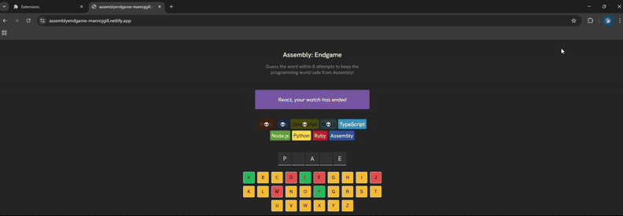

# Leads Tracker (Chrome Extension)

A Chrome extension built as a **build-along project** during the Scrimba Learn JavaScript course. It allows you to save and manage leads (links). You can save typed URLs, capture the current tab, and delete saved leads. All leads are stored in localStorage so they remain available between sessions.

## Demo
Here’s a video/GIF demo of the extension in action:  

## Important Note
This extension is not published to the Chrome Web Store.  
It only works if you **manually copy the files** and load it into Chrome using **Developer Mode**.

## Installation (Developer Mode)
1. Download or copy the project files.  
2. Open **Chrome** and go to `chrome://extensions/`.  
3. Enable **Developer mode** (toggle in the top right).  
4. Click **Load unpacked** and select this project folder.  
5. The extension will appear in your Chrome toolbar.  

## Features
- Save input URLs from a text field  
- Save the current browser tab with one click  
- Display all saved leads as clickable links  
- Double-click delete button to clear all saved leads  
- Persistent storage using `localStorage`  

## How It Works
- **index.js**:
  - Saves input values or active tab URL into `myLeads` array  
  - Renders list items as clickable links dynamically  
  - Stores/retrieves leads in `localStorage`  
  - Supports double-click on delete button to clear all leads  
- **manifest.json**:
  - Defines Chrome extension metadata and permissions (`tabs`)  
  - Loads `index.html` as the popup UI  
